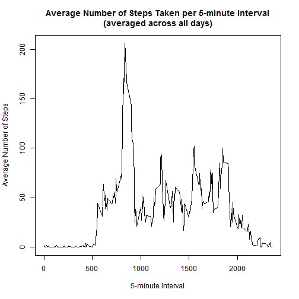

# Reproducible Research: Peer Assessment 1

## Introduction

This is the Peer Assessment 1 Report for the Reproducible Research course on Coursera. This introduction can also be found within this github repository.

It is now possible to collect a large amount of data about personal movement using activity monitoring devices such as a Fitbit, Nike Fuelband, or Jawbone Up. These type of devices are part of the "quantified self" movement -- a group of enthusiasts who take measurements about themselves regularly to improve their health, to find patterns in their behavior, or because they are tech geeks. But these data remain under-utilized both because the raw data are hard to obtain and there is a lack of statistical methods and software for processing and interpreting the data.

This assignment makes use of data from a personal activity monitoring device. This device collects data at 5 minute intervals through out the day. The data consists of two months of data from an anonymous individual collected during the months of October and November, 2012 and include the number of steps taken in 5 minute intervals each day.

This report answers the questions of:

- What is the mean total number of steps taken per day? 
- What is the average daily activity pattern?
- Are there differences in activity patterns between weekdays and weekends?

## Loading and preprocessing the data

Load the data from the dataset located on the course web site.  

The data on the course website is in a .csv file located within the .zip file.  This code reads the .csv data directly from the .zip file.


```r
# Use setInternet2 to make R appear to be the same as Internet Explorer and download secure files without errors
        setInternet2(use=TRUE)

# Download .zip data from course website
        fileUrl <- "https://d396qusza40orc.cloudfront.net/repdata%2Fdata%2Factivity.zip"
        download.file(fileUrl,"./data/activity.zip")

# Read in the .csv data directly from the .zip file
        data <- read.csv(unz("./data/activity.zip","activity.csv"))
```

Formate the date column to be of a date format

```r
# load timeDate package
        library(timeDate)
```

```
## Warning: package 'timeDate' was built under R version 3.1.1
```

```r
# Create a new column called "day" that contains the days of the week to the dataset with imputed data 
        data$date <- as.Date(data$date,format="%Y-%m-%d")
```


## What is the mean total number of steps taken per day?

For this part of the assignment, the missing values in the dataset are ignored.  Rows of the dataset with NA's can be ignored using `complete.cases()`.

A histogram of the total number of steps taken each day can be created to visually estimate the mean total number of steps taken per day.


```r
# load plyr package
        library(plyr)

# Sumarize total number of steps by date for complete cases (no NAs)
        histdata <- ddply(data[complete.cases(data),],.(date), summarise, total = sum(steps))

# Create histogram
        hist(histdata$total,col="slategray", 
             main="Total Number of Steps Taken Each Day", 
             xlab="Total Number of Steps")
```

 

From the histogram, the mean and median total number of steps taken per day can be visually estimated to be between 1,000 and 1,500 steps.

The actual mean and median total number of steps taken per day can be calcluated as follows:


```r
# Calculate the mean total nubmer of steps by date for complete cases (no NAs)
        meandata <- mean(histdata$total)

# Print mean
        print(meandata)
```

```
## [1] 10766
```

```r
# Calculate the median total nubmer of steps by date for complete cases (no NAs)
        mediandata <- median(histdata$total)

# Print median

        print(mediandata)
```

```
## [1] 10765
```


The calculated mean number of steps taken per day is 1.0766 &times; 10<sup>4</sup> steps.  And the calculated median total number of steps taken per day is 10765 steps.

## What is the average daily activity pattern?

For this part of the assignment, the missing values in the dataset are ignored.  Rows of the dataset with NA's can be ignored using `complete.cases()`.

A time series plot of the 5-minute interval and the average number of steps taken, averaged across all days, can be created to visually understand the average daily activity pattern. 


```r
# load plyr package
        library(plyr)

# Sumarize average number of steps by 5-minute interval for complete cases (no NAs)
        timedata <- ddply(data[complete.cases(data),],.(interval), summarise, avg = mean(steps))

# Create time series plot
        plot(x=timedata$interval,y=timedata$avg,type="l", 
             main="Average Number of Steps Taken per 5-minute Interval\n(averaged across all days)", 
             ylab="Average Number of Steps", 
             xlab="5-minute Interval")
```

 

From the time series plot, it can be seen that the maximum number of average steps
is taken in a 5-minute interval between the 500th 5-minute interval of a day and the 1,000th 5-minute interval of the day.

The actual 5-minute interval, on average across all the days in the dataset, that contains the maximum number of steps can be calcluated as follows:


```r
# Calculate the maximum number of steps for 5-minute intervals for complete cases (no NAs)
        maxsteps <- timedata[timedata$avg == max(timedata$avg),1]

# Print maximum steps
        print(maxsteps)
```

```
## [1] 835
```

Therefore, The 835th 5-minute interval, on average across all the days in the dataset for complete cases, contains the maximum number of steps.

## Imputing missing values

It is noted that there are a number of days/intervals where there are missing values (coded as `NA`).  The presence of missing days may introduce bias into some calculations or summaries of the data.  

Missing values would be considered as the rows of the data set which have NA for steps. The total number of missing values in the dataset can be calculated as follows: 


```r
# Calculate the total number of missing values in the the dataset.
        missing <- sum(!complete.cases(data))
```

The total number of missing values in the dataset is 2304.

It is interesting to note that the missing values are actually only complete days of missing data.


```r
# load plyr package
        library(plyr)

# Calculate how many missing intervals per date with missing values
        missingintervals <- ddply(data[!complete.cases(data),],.(date), summarise, no.intervals = length(interval))

# print out table
        print(missingintervals)
```

```
##         date no.intervals
## 1 2012-10-01          288
## 2 2012-10-08          288
## 3 2012-11-01          288
## 4 2012-11-04          288
## 5 2012-11-09          288
## 6 2012-11-10          288
## 7 2012-11-14          288
## 8 2012-11-30          288
```

As can be seen in the above table, there are 8 days with missing step data.  In each day there are 288 intervals missing step data.  There are 288 5-minute intervals in a 24 hour day since 288 * 5 minutes is 1,440 minutes. And there are 1,440 minutes in 24 hours since 1,440/60 is 24. 

Since there are 2304 missing step values in the dataset which covers 8 complete days, a strategy for imputing missing values is sought.  The strategy for filling in all the missing step values in the dataset is to replace the NA value with the mean for that 5-minute interval averaged across all the days.

A new dataset that is equal to the original dataset but with the missing data filled in, according to the strategy above, can be created using the following code:


```r
# load plyr package
        library(plyr)

# create a impute function that replaces a na value with the mean of the nonmissing values
        impute.mean <- function(x) replace(x, is.na(x), mean(x,na.rm=TRUE))

# create a new dataset which imputes the steps when steps are missing
        data2 <-  ddply(data, ~interval,transform, steps=impute.mean(steps))       

# Sort new dataset based on date and interval
        data2 <- data2[with(data2,order(date,interval)),]
```

A histogram of the total number of steps taken each day can be created to visually estimate the mean total number of steps taken per day.


```r
# load plyr package
        library(plyr)

# Sumarize total number of steps by date for complete cases (no NAs)
        histdata2 <- ddply(data2,.(date), summarise, total = sum(steps))

# Create histogram
        hist(histdata2$total,col="slategray", main="Total Number of Steps Taken Each Day", xlab="Total Number of Steps")
```

 

From the histogram, the mean and median total number of steps taken per day can be visually estimated to be between 1,000 and 1,500 steps.

The actual mean and median total number of steps taken per day can be calcluated as follows:


```r
# Calculate the mean total nubmer of steps by date for the dataset with imputed data
        meandata2 <- mean(histdata2$total)

# Calculate the median total nubmer of steps by date for the dataset with imputed data
        mediandata2 <- median(histdata2$total)
```

The calculated mean number of steps taken per day for dataset with imputed data is 1.0766 &times; 10<sup>4</sup> steps.  And the calculated median total number of steps taken per day for the dataset with imputed data is 1.0766 &times; 10<sup>4</sup>.

A summary of the steps per day from the first part of this assignment and from the imputed data can also be seen below.


```r
# print summary of total daily steps from first part of assignment (complete cases)
        print(summary(histdata$total))
```

```
##    Min. 1st Qu.  Median    Mean 3rd Qu.    Max. 
##      41    8840   10800   10800   13300   21200
```

```r
# print summary of total daily steps from the dataset with imputed data
        print(summary(histdata2$total))
```

```
##    Min. 1st Qu.  Median    Mean 3rd Qu.    Max. 
##      41    9820   10800   10800   12800   21200
```

The values for the mean number of steps taken per day using the imputed data in comparison to the estimates from the first part did not change at all.  This is to be expected since 288 intervals of step data were missing from each of the eight days with missing data; esentially eight complete days of step data was missing.  This has the implication of the imputed data having exactly the average total number of steps taken per day from the first part of the assignment and thus the new mean number of steps taken per day is also the same.  

The values for median number of steps taken per day using the imputed data differs only slightly from the estimates from the first part of the assignment. This is also to be expected since 8 additional days were added to the data.  This results in the middle value of the dataset (median) being slightly shifted from the first part.

Therefore, using the imputing strategy employed, there is very little impact of imputing missing data on the estimates of the total daily number of steps.  Different imputing strategies would result in a varying level of impact.

## Are there differences in activity patterns between weekdays and weekends?

Physical activity patterns may be different for weekdays and weekends.  Using the dataset with the filled-in missing values, a new factor variable was created in the dataset with two levels -- "weekday" and "weekend" indicating whether a given date is a weekday or a weekend day.


```r
# load timeDate and plyr package
        library(timeDate)
        library(plyr)

# Change the formate for date to a timeDate format
        data2$date <- timeDate(data2$date,format="%Y-%m-%d")

# Create a new column called "day" that contains TRUE for a weekday and FALSE for the weekend for the dataset with imputed data 
        data2$day <- as.factor(isWeekday(data2$date))

# rename the factors: TRUE = Weekday and FALSE = Weekend
        data2$day <- revalue(data2$day, c("TRUE"="weekday", "FALSE"="weekend"))
```

With the dataset indicating weekday and weekend, a panel plot containing a time series plot of the 5-minute interval and the average number of steps taken, averaged across all weekday days or weekend days can be created with the following code:


```r
# load lattice package
        library(lattice)

# Create an dataset which summarizes the average number of steps per 5-minute interval for weekdays and weekends.
        aggdata <- aggregate(steps ~ interval + day, data=data2, mean)

# Create time series plot
        xyplot(aggdata$steps~aggdata$interval|aggdata$day,
                type="l",
                main = "Time Series Plot of Average Number of Steps per 5-Minute Interval\n(for Weekday days and Weekend days)",
                ylab = "Average Number of Steps",
                xlab = "5-Minute Interval",
                layout = c(1,2))
```

 

From the time series plot, it can be seen that there are some differences in the activity patterns between weekdays and weekends.  Activity starts at an earlier 5-minute interval on weekday days than on weekend days.  This may indicate getting up earlier during the week to go to work.  The highest average number of steps occur around the same time of day regardless of weekday or weekend day.  Although weekdays have a higher maximum average number of steps per 5-minute interval.  Overall, activity seems to be spread across the day more in during the weekend days than during the weekday days. 
